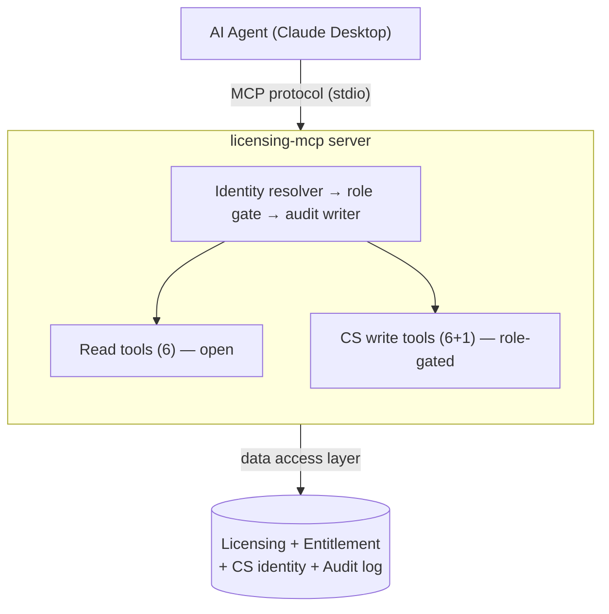
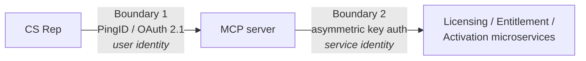

# Licensing Intelligence MCP

## Agentic access to licensing & entitlement data

<div class="absolute bottom-10">
  <span class="font-700">
    Rohit Maryada · June 2026 · MathWorks internal
  </span>
</div>

<!--
Open with the demo promise: in 10 minutes you'll watch an AI agent diagnose
and resolve a real CS ticket, with a better audit trail than a human writes.
-->

---
layout: section
---

# The stack was built for humans

---

# Two stacks, one assumption

<div class="grid grid-cols-2 gap-8 pt-4">

<div>

### Customer-facing

```
MS SQL Server
  → Microservices (REST)
    → External UIs
      → Customer (human)
```

Session tokens, paginated pages, dashboards

</div>

<div>

### CS-facing

```
MS SQL Server
  → Microservices (REST)
    → Internal CS tooling
      → CS Rep (human)
```

Role-gated, audited, reason captured

</div>

</div>

<div class="pt-8 text-xl text-center opacity-90">
Every layer assumes a <b>human at a browser</b> is the consumer.
</div>

---

# AI agents are a new consumer type

<v-clicks>

- **No UI** — they receive structured data and reason over it
- **No session** — identity and permissions must travel with each call
- **Domain-aware tools** — not raw REST endpoints requiring URL-scheme knowledge
- **They act** — write operations on behalf of a user, which demands audit of *reasoning*, not just actions

</v-clicks>

<div v-click class="pt-10 text-xl text-center">
This is not an AI-wrapper problem.<br>
<b>It's an interface-layer problem.</b>
</div>

---
layout: section
---

# Architecture

---

# MCP in one sentence

<div class="text-2xl leading-relaxed pt-8 text-center">

**MCP is to agents what REST is to web apps** —<br>the interface contract between consumer and provider.

</div>

<div v-click class="text-xl leading-relaxed pt-10 text-center opacity-90">

And like REST, it is <b>not a security boundary</b>.<br>
Security lives in the layers around it.

</div>

<!--
Anthropic's open standard, adopted by Claude, Cursor, VS Code, Atlassian,
Microsoft. Tools are typed, described, schema-validated functions the
model can call.
-->

---

# One server, two capability surfaces



<div class="grid grid-cols-2 gap-8 text-sm pt-2">
<div>

**Query surface** — customer-scoped, read-only
*"Which licenses expire this quarter?"*

</div>
<div>

**Action surface** — bound to a CS rep's role, every write audited
*"Revoke that stale activation."*

</div>
</div>

---

# The tool surface

<div class="grid grid-cols-2 gap-6 text-sm">

<div>

### Read (open)

| Tool | Answers |
|---|---|
| `get_license_status` | Is L-99001 active? Seats? |
| `check_user_entitlements` | What can jane.doe run? |
| `list_licenses_by_entity` | What does Acme hold? |
| `get_license_products` | What's on this license? |
| `get_license_administrators` | Who manages it? |
| `search_entitlements` | Expiring enterprise licenses? |

</div>

<div>

### Write (role-gated)

| Tool | Role |
|---|---|
| `add_user_to_license` | CS-L1 |
| `revoke_activation` | CS-L1 |
| `reset_installation_slot` | CS-L2 |
| `update_seat_count` | CS-L2 |
| `extend_license_expiry` | CS-L3 |
| `transfer_license_admin` | CS-L3 |
| `get_audit_history` | any CS |

</div>

</div>

<div class="pt-4 text-center text-sm opacity-80">
Each tool = one domain operation. No "run query" escape hatch.
</div>

---

# Every write funnels through one pipeline

```python
# cs_executor.py — the only path to a mutation
resolve identity      # who is calling (env var → JWT in production)
  → permission gate   # can this role call this tool? (data, not code)
    → mutate          # capture before/after state
      → write audit   # who, role, action, REASON, before/after
        → commit      # mutation + audit: ONE transaction
```

<v-clicks>

- An **unaudited write is structurally impossible** — audit failure rolls back the mutation
- **Rejections are audited too** — a CS-L1 probing an L3 tool is a security signal
- Destructive tools require **server-driven confirmation** with computed context

</v-clicks>

---
layout: section
---

# Live demo

<div class="text-base opacity-70 pt-4">
Story 1 · Customer query agent &nbsp;&nbsp;|&nbsp;&nbsp; Story 2 · CS action agent
</div>

---

# Story 2, scripted

*jane.doe@acmecorp.com can't activate Simulink on her new laptop*

<v-clicks>

1. Agent checks entitlements → **she IS entitled** via L-99001
2. Agent checks the license → active, but **seats 10/10 — at capacity**
3. Agent inspects her activations → **stale activation** on a decommissioned machine, last heartbeat 115 days ago
4. Rep says revoke → server asks for **confirmation with the evidence** → revoked, slot freed
5. Agent shows the **audit trail** — including the entry it just wrote

</v-clicks>

<div v-click class="pt-6 text-center opacity-90">
Diagnose → propose → act → audit. One conversation.
</div>

---

# The audit record is the headline

<div class="grid grid-cols-2 gap-6 text-sm pt-2">

<div>

### Human rep writes…

```json
{
  "action": "revoke_activation",
  "reason": "fixed issue"
}
```

</div>

<div>

### The agent writes…

```json
{
  "audit_id": "AUD-02001",
  "actor": "rep.sarah@mathworks.com (CS-L1)",
  "action": "revoke_activation",
  "reason": "User cannot activate Simulink on
    new laptop. Entitled via L-99001; seats
    10/10; stale activation on decommissioned
    MAC-OLD-7291 (115 days). Revoking to
    free the slot.",
  "before": {"seat_utilization": "10/10"},
  "after":  {"activation": "revoked"}
}
```

</div>

</div>

<div v-click class="pt-4 text-center">
The agent's reasoning chain <b>becomes</b> the audit record — automatically.
</div>

---
layout: section
---

# Security posture

---

# POC shortcuts → production equivalents

| Dimension | POC (today) | Production |
|---|---|---|
| Actor identity | `CS_ACTOR_ID` env var | PingID JWT, validated per request |
| Who can connect | config file access | OAuth 2.1 + IdP group (10 of 500 reps) |
| Transport | stdio, local | Streamable HTTP + TLS, API gateway |
| Data access | SQLAlchemy → SQLite | Signed calls to existing microservices |
| Server's own identity | — | Registered service consumer (private_key_jwt) |
| Audit store | same DB | Append-only, compliance-grade store |
| Row-level scoping | none | Reps scoped to assigned accounts |

<div v-click class="pt-4 text-center text-base">
Every gap is a <b>known engineering problem</b> on infrastructure we already operate.
</div>

---

# Two auth boundaries — never conflated



<v-clicks>

- The MCP server is **just another registered service consumer** — same business-case approval, same key registration as any internal service
- A valid user token at Boundary 1 grants **nothing** at Boundary 2
- This is how Atlassian, Microsoft, and the MCP spec itself structure it

</v-clicks>

---
layout: section
---

# Path to production

---

# The wedge: CS Tier-1 activation copilot

<div class="grid grid-cols-2 gap-10 pt-4">

<div>

### Why this use case first

- **High volume** — "can't activate / seats full" is a top ticket pattern
- **Well-understood** — fixed diagnostic path
- **Low risk** — revocation is reversible
- **Measurable** — handle time vs. manual baseline

</div>

<div>

### Sequencing

1. Swap env-var identity → PingID OAuth
2. Point data access at real microservices
3. Scope to CS-L1 + activation fixes only
4. Instrument: resolution time, deflection
5. Expand tiers and tool surface from evidence

</div>

</div>

<div v-click class="pt-8 text-center text-lg">
Same read surface later powers <b>customer self-service</b> — without rebuilding.
</div>

---
layout: center
class: text-center
---

# Questions

<div class="pt-6 text-sm opacity-70">

repo: github.com/rohitmaryada/Licensing-MCP (private)
·
security model: `security-considerations-mcp-access.md`

</div>
